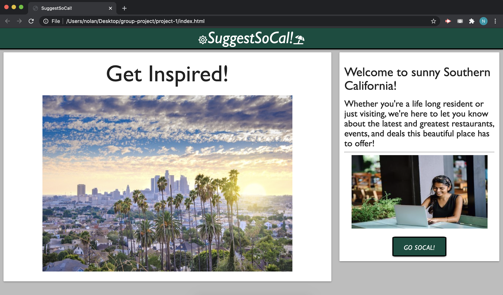
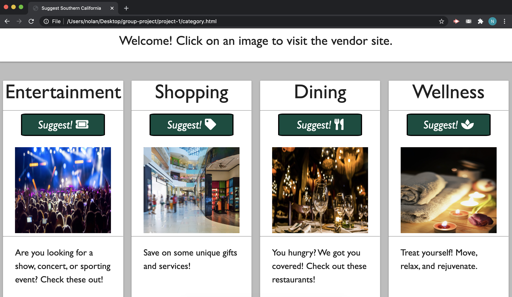

# SuggestSoCal.com

# Website
The purpose of this webpage is to display the best deals, events, and restaurant suggestions within the southern California region.

This projects features multiple html pages linked to a JS and a CSS page:

The website contains a:

Header title with the project title.

A button that redirects the user to the webpage that displays the deals and events within separate cards.

Within the cards are buttons that once the user clicks on, will generate deals or events within the category they are in.

This site has been formatted for handset devices including, iphone, android and most responsive web browsers.

## Acceptance Criteria 

The website meets all of the project requirements including the following:

1. Must use at least two server-side APIs.

2. Must use a CSS framework other than Bootstrap.

3. Use at least one new third-party API.

4. Must have a polished, mobile-first UI.

5. Must meet good quality coding standards (indentation, scoping, naming, etc.).

6. Does NOT use alerts, confirms, or prompts (look into modals).

7. Must be deployed to GitHub Pages.

8. Must be interactive (i.e: accept and respond to user input).

## Getting started and deployment

This site can be accessed by clicking the link below:
https://mitch-t.github.io/suggestsocalapp/

## Built With
* HTML
* CSS
* JAVASCRIPT
* Materialize
* J-Query
* Font-awesome

## Created by

Jackie Perez / UCR Extension Program Coding Bootcamp Student
Thomas Michell / UCR Extension Program Coding Bootcamp Student
Edgar Gonzalez / UCR Extension Program Coding Bootcamp Student
Rudi Kraeher / UCR Extension Program Coding Bootcamp Student
Nolan Sanchez / UCR Extension Program Coding Bootcamp Student

## Screenshots

